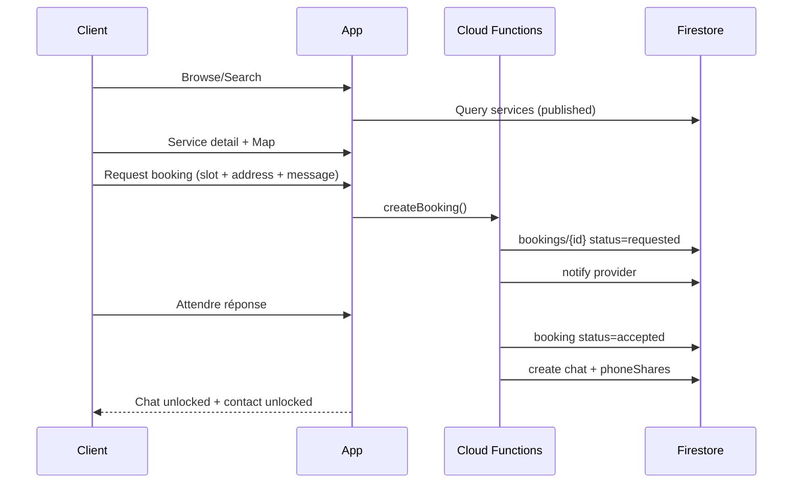
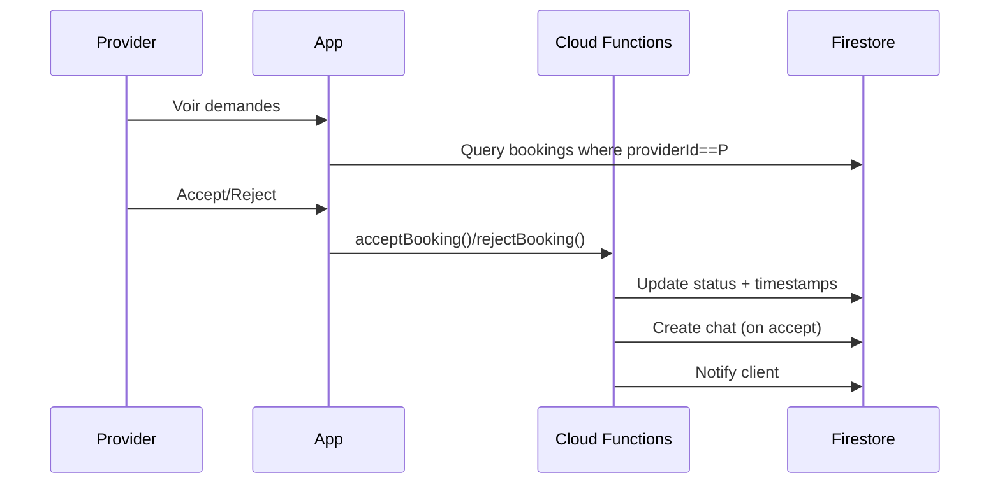

# Outlama — PROJECT_SPEC (MVP)

## Objectif
Construire une marketplace **de services à domicile** (client ↔ provider) avec une **seule app** (un user peut devenir provider via un switch façon Turo) + **booking** + **chat temps réel** + **map** + **modération admin**.

**Scope MVP (100–1k users, FR + SN)** : pas de paiement intégré.

## Stack (décision)
- **App**: Flutter (from scratch, design system custom)
- **Backend**: Firebase (Auth, Firestore, Storage, Cloud Functions)
- **Admin**: Web séparé (Next.js) + Firebase Auth + custom claims `admin`

---

## 0) Décisions de produit (non négociables)
1) **User multi-rôle** : un compte unique peut être client + provider. Switch UI persistant.
2) **Booking state machine** : `requested → accepted → in_progress → done` (+ `rejected`, `cancelled`).
3) **Chat booking-gated** : pas de chat libre. Un chat existe **uniquement après accept**.
4) **Téléphone type BlaBlaCar** : le numéro n’est **jamais public**. Déverrouillage **après accept**.
5) **Server-authoritative** : transitions critiques via Cloud Functions (défense en profondeur).

---

## 1) UX Pillars (Uber / BlaBlaCar / Turo)
- **Uber (simplicité)** : 3 étapes max pour booker (service → créneau/adresse → message → envoyer).
- **BlaBlaCar (confiance)** : profil + avis + contact unlock après accept + reporting.
- **Turo (switch mode)** : un switch clair « Mode Client / Mode Provider ».
- **Map premium** : distance + ETA, route / zone, carte lisible (pas gadget).

---

## 2) Modules MVP
### Client
- Auth + profil
- Browse / Search services (catégories, liste, filtre simple)
- Service detail + Map (ETA/distance)
- Create booking request (créneau + adresse + **message libre**)
- Booking tracking (timeline)
- Chat (après accept)
- Reviews (après done)

### Provider
- Activation provider (sans approval)
- CRUD services (photos, zone, prix de base)
- Inbox de demandes + accept/reject
- Gestion bookings (in progress/history)
- Chat (par booking)

### Admin (web)
- Suspend provider / service
- Voir bookings (lecture)
- Modération messages (delete) + reports

---

## 3) Flows (MVP)
### 3.1 Flow Client (happy path)

### 3.2 Flow Provider

---

## 4) Data model Firestore (décision)
> Pivot = **bookings** top-level + **chats/messages**.

### 4.1 Collections
#### `users/{uid}`
- `displayName`, `photoPath`
- `country` (FR|SN), `phoneE164` (privé)
- `activeMode` (client|provider)

#### `providers/{uid}`
- `active` (bool), `suspended` (bool)
- `bio`, `serviceArea` (ville / zone)

#### `services/{serviceId}` (public read)
- `providerId`
- `title`, `description`, `categoryId`
- `priceType` (hourly|fixed), `price`
- `photos[]`, `published` (bool)

#### `bookings/{bookingId}`
- `customerId`, `providerId`, `serviceId`
- `status` enum
- `requestMessage` (string)
- `schedule` (timestamp/slot)
- `addressSnapshot` (struct)
- `createdAt`, `acceptedAt`, `doneAt`
- `chatId` (set à accept)

#### `chats/{chatId}`
- `bookingId`
- `participantIds: [customerId, providerId]`
- `createdAt`, `lastMessageAt`

#### `chats/{chatId}/messages/{messageId}`
- `senderId`
- `type` (text|image)
- `text` (string)
- `createdAt`

#### `bookings/{bookingId}/phoneShares/{uid}` (unlock contact)
- docId = uid du propriétaire
- `phone` (string), `createdAt`

#### `reports/{reportId}`
- `reporterId`, `targetType`, `targetId`, `reason`, `createdAt`, `status`

---

## 5) Security model (principes)
- **Deny by default**.
- `services`: read public; write = owner provider.
- `bookings`: read = customer/provider.
- `chats/messages`: read/write uniquement si `uid ∈ participantIds`.
- `phoneShares`: lisible uniquement si booking `accepted`.
- `admin`: uniquement via **custom claims** `request.auth.token.admin == true`.

> Les règles complètes v1 sont dans `firebase/firestore.rules` et `firebase/storage.rules` (à ajouter au repo).

---

## 6) Cloud Functions (MVP minimal)
### Callable/HTTP
- `createBooking(serviceId, schedule, addressSnapshot, requestMessage)`
- `acceptBooking(bookingId)` / `rejectBooking(bookingId)`
- `cancelBooking(bookingId)` (selon statut)

### Triggers
- `onMessageCreate` → notif à l’autre participant + anti-spam
- `onBookingStatusChange` → notif

### Admin
- `setAdminClaim(uid)`
- `suspendProvider(uid)` / `removeService(serviceId)` / `deleteMessage(chatId, messageId)`

---

## 7) Roadmap
### Sprint 0 (Foundation)
- Firebase projects dev/staging/prod
- Firestore/Storage rules v1 + tests manuels 2 comptes
- Auth + profil + switch mode
- Skeleton UI + design tokens

### Sprint 1 (Core)
- CRUD service provider + listing client
- Booking request + accept/reject (Functions)
- Booking screens (client/provider)

### Sprint 2 (Chat + polish)
- Chat temps réel (post-accept) + notifications
- Contact unlock
- Reports + modération admin minimal

---

## 8) Open questions (à figer avant dev UI)
- Services initiaux (3 catégories MVP)
- Politique annulation MVP
- Map: simple ETA/distance vs suivi live (on reste simple en MVP)
